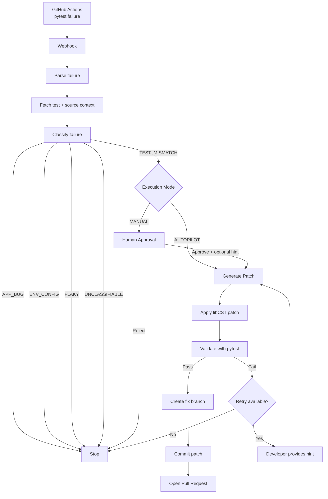
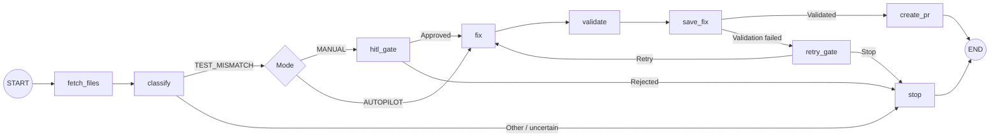
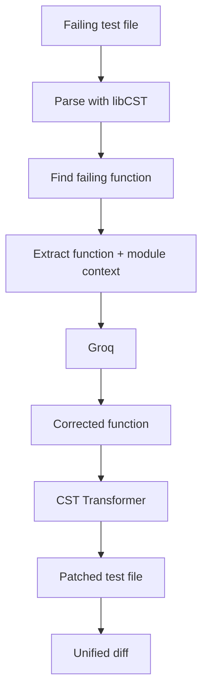
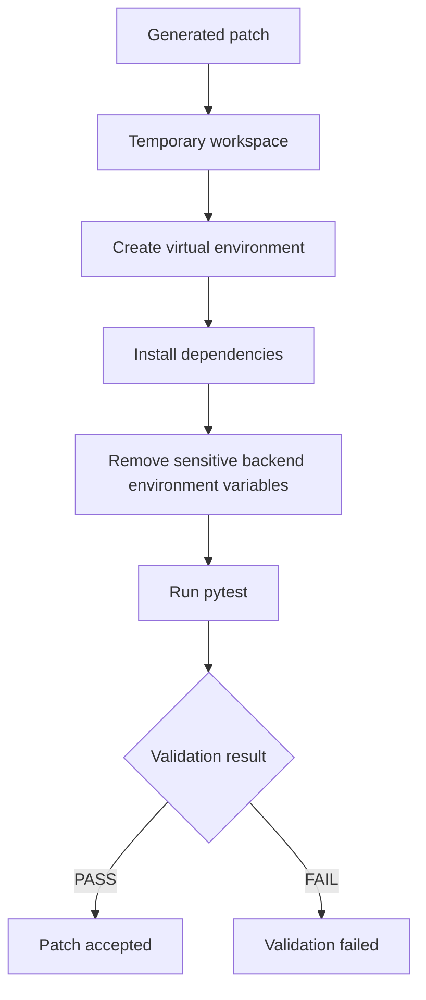
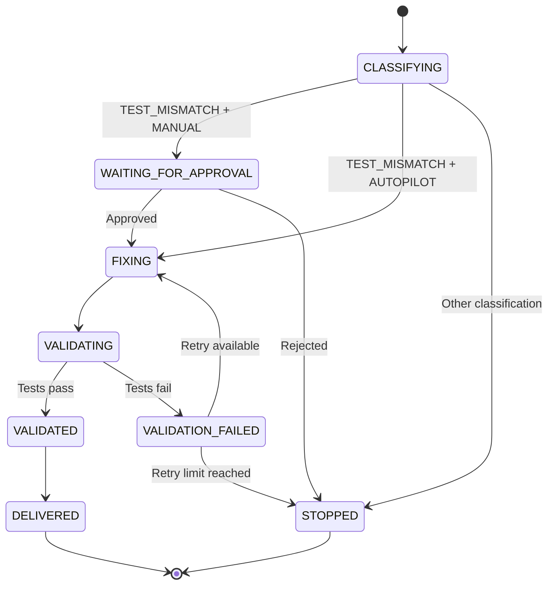
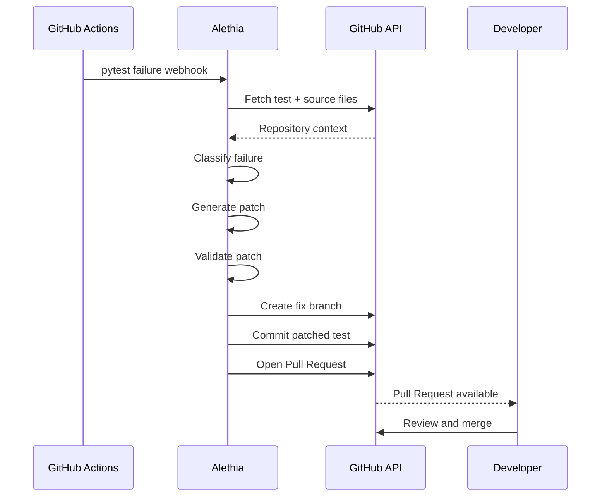
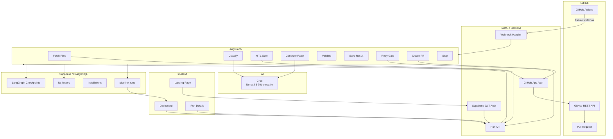

<div align="center">
  

  <h1>Alethia</h1>
  
  <p>
    A GitHub App that analyzes pytest failures, generates targeted test patches,
    validates them, and opens a Pull Request.
  </p>

  <br />

  <a href="https://alethia-gamma.vercel.app/">
    
  </a>

  <br />
</div>

## Overview

When a CI run fails, fixing it usually means reading the traceback, finding the relevant test and source code, figuring out what changed, updating the test, and running it again.

Alethia automates that loop for a specific kind of failure: **test mismatches caused by intentional application changes**.

A GitHub Actions failure is sent to Alethia, where a LangGraph workflow:

1. Parses the pytest failure.
2. Fetches the relevant test and source files.
3. Classifies the failure with an LLM.
4. Waits for developer approval when running in manual mode.
5. Generates a targeted patch.
6. Runs the patched test in a temporary environment.
7. Opens a Pull Request if validation succeeds.

Alethia does not try to fix every CI failure. If the failure looks like an application bug, environment problem, flaky test, or something it cannot classify confidently, the workflow stops instead.

---

## How It Works



---

## Failure Classification

Alethia intentionally narrows the scope of automated repair.

| Classification   | Behaviour                    |
| ---------------- | ---------------------------- |
| `TEST_MISMATCH`  | Continue to patch generation |
| `APP_BUG`        | Stop                         |
| `ENV_CONFIG`     | Stop                         |
| `FLAKY`          | Stop                         |
| `UNCLASSIFIABLE` | Stop                         |

For example, if an application intentionally changes from returning `200` to `201`, and an existing test still expects `200`, Alethia can identify the outdated assertion as a test mismatch.

If the application itself appears to be broken, Alethia does not blindly modify the test to make CI green.

---

## The Repair Workflow

The repair process is implemented as a stateful LangGraph workflow.



The graph is checkpointed so it can pause at the human approval and retry points and resume later.

---

## AI Classification

The classifier uses Groq with `llama-3.3-70b-versatile`.

The model receives the pytest failure along with relevant repository context and returns a structured classification.

The workflow does not simply ask:

> "How do I fix this?"

Instead, the first question is whether the failure should be fixed automatically at all.

That distinction is important because changing a test to hide an actual application bug would make the system worse, not better.

---

## Source Resolution

Before classification, Alethia tries to give the model the relevant code instead of relying only on the traceback.

The failing test is parsed using Python's built-in `ast` module to discover imported application modules.

The resulting context can include:

```text
pytest failure
     +
failing test
     +
relevant application source
     ↓
failure classification
```

This keeps the model focused on the code involved in the failure rather than the entire repository.

---

## Surgical Test Patching

The patching stage is where Alethia differs from a simple "LLM writes a file" approach.

Instead of asking the model to rewrite the entire test file, Alethia uses **libCST** to locate the failing function.



The generated response is expected to contain the corrected function rather than a rewritten test file.

Alethia then uses a CST transformer to replace the relevant function while leaving unrelated parts of the file untouched.

This makes the resulting diff smaller and easier to review.

If CST parsing fails, the implementation has a full-file rewrite fallback.

---

## Validation

A generated patch is not immediately pushed to GitHub.

Alethia downloads the repository into a temporary workspace, creates a temporary virtual environment, installs the required dependencies, and runs the relevant pytest test.



Validation has a 60-second timeout.

Sensitive backend environment variables such as keys, tokens, secrets, and the database URL are removed from the test process environment.

The temporary workspace is cleaned up after execution.

---

## Human-in-the-Loop

Alethia has two execution modes.

### Manual

The graph pauses after a `TEST_MISMATCH` classification.

The developer can:

* Review the failure
* Review the AI classification
* Read the model's reasoning
* Provide an optional hint
* Approve the patch
* Reject the repair

The graph then resumes from its checkpoint.

### Autopilot

The workflow proceeds directly from classification to patch generation without the approval pause.

---

## Retry Flow

If a generated patch fails validation, manual mode can retry the repair with additional developer guidance.



The retry ceiling is enforced at two levels so the workflow cannot continue indefinitely.

---

## Pull Request Creation

Once validation succeeds, Alethia creates a dedicated fix branch from the original Pull Request's head branch.



The Pull Request contains the generated change and the failure diagnosis so the developer can review the result in the normal GitHub workflow.

---

## Architecture



---

## Security

Alethia handles GitHub webhooks, repository contents, generated patches, and authentication tokens, so several parts of the workflow are explicitly guarded.

### Webhook verification

GitHub webhook requests are verified using HMAC-SHA256 before they are processed.

### API authentication

Protected backend endpoints validate Supabase JWTs.

### GitHub App authentication

GitHub repository operations use GitHub App installation authentication.

Installation tokens are cached in memory to avoid repeatedly requesting new tokens during a run.

### Repository access

Repository installations are associated with users in Supabase, with Row-Level Security policies controlling access to stored run data.

### Validation environment

Generated code is executed in a temporary workspace with a restricted environment and a timeout.

This is designed for the specific Python/pytest workflow Alethia supports; it is not intended to be a general-purpose arbitrary-code sandbox.

---

## Audit Trail

Important workflow actions are recorded in `fix_history`.

Examples include:

```text
WEBHOOK_RECEIVED
CLASSIFIED
APPROVED
FIX_GENERATED
PR_OPENED
STOPPED
```

This makes it possible to trace a repair attempt from the original CI failure through its final outcome.

---

## Tech Stack

| Layer               | Technology                       |
| ------------------- | -------------------------------- |
| Frontend            | React 19, Vite 8, React Router 7 |
| Styling             | Custom CSS                       |
| Backend             | FastAPI, Uvicorn, Python 3.12+   |
| AI Workflow         | LangGraph, LangChain Core        |
| LLM                 | Groq — `llama-3.3-70b-versatile` |
| Code Transformation | libCST                           |
| Source Analysis     | Python `ast`                     |
| GitHub Integration  | GitHub App, PyGithub             |
| Database            | PostgreSQL via Supabase          |
| Authentication      | Supabase Auth                    |
| Realtime            | Supabase Realtime                |
| Checkpointing       | LangGraph PostgresSaver          |
| Frontend Deployment | Vercel                           |
| Backend Deployment  | Render                           |

---

## Project Structure

```text
alethia/
├── agent/
│   ├── graph.py
│   ├── state.py
│   └── nodes/
│       ├── fetcher.py
│       ├── classifier.py
│       ├── fixer.py
│       ├── validator.py
│       ├── pr_creator.py
│       └── stopper.py
│
├── backend/
│   ├── app/
│   │   ├── api/
│   │   │   ├── webhook.py
│   │   │   ├── runs.py
│   │   │   ├── github.py
│   │   │   └── health.py
│   │   ├── core/
│   │   │   ├── auth.py
│   │   │   ├── config.py
│   │   │   └── log_parser.py
│   │   ├── db/
│   │   │   └── client.py
│   │   └── github/
│   │       └── auth.py
│   ├── migrations/
│   ├── scripts/
│   └── tests/
│
├── frontend/
│   └── src/
│       ├── components/
│       ├── context/
│       ├── lib/
│       ├── pages/
│       ├── App.jsx
│       └── main.jsx
│
├── pyproject.toml
└── .env.example
```

---

## Getting Started

### Prerequisites

* Python 3.12+
* Node.js 18+
* A Supabase project
* A registered GitHub App
* A Groq API key
* ngrok or another public webhook tunnel for local GitHub webhook development

### 1. Clone the repository

```bash
git clone https://github.com/imshreyaskn/alethia.git
cd alethia
```

### 2. Configure the environment

Copy the example environment file:

```bash
cp .env.example .env
```

Then configure the required backend variables.

#### Backend

```env
DEBUG=true
FRONTEND_URL=http://localhost:5173

SUPABASE_URL=
SUPABASE_SERVICE_KEY=
DATABASE_URL=

GITHUB_APP_ID=
GITHUB_APP_PRIVATE_KEY=
GITHUB_WEBHOOK_SECRET=

GROQ_API_KEY=
GROQ_MODEL=llama-3.3-70b-versatile
```

#### Frontend

Create `frontend/.env`:

```env
VITE_SUPABASE_URL=
VITE_SUPABASE_ANON_KEY=
VITE_API_URL=http://localhost:8000/api
VITE_GITHUB_APP_NAME=
```

Never commit real credentials.

### 3. Set up Supabase

Run the SQL migrations in order:

```text
backend/migrations/001_core_tables.sql
backend/migrations/002_add_columns.sql
backend/migrations/002_enable_rls.sql
backend/migrations/003_saas_readiness.sql
backend/migrations/004_delete_policy.sql
backend/migrations/005_schema_fixes.sql
```

### 4. Start the backend

```bash
cd backend
python -m venv .venv
```

Windows:

```powershell
.venv\Scripts\activate
```

macOS/Linux:

```bash
source .venv/bin/activate
```

Install dependencies:

```bash
pip install -r requirements.txt
pip install -r ../agent/requirements.txt
```

Then install the project package:

```bash
cd ..
pip install -e .
```

Start FastAPI:

```bash
cd backend
uvicorn app.main:app --reload --port 8000
```

### 5. Start the frontend

In another terminal:

```bash
cd frontend
npm install
npm run dev
```

The frontend will be available at:

```text
http://localhost:5173
```

### 6. Configure the GitHub webhook

For local development, expose the backend:

```bash
ngrok http 8000
```

Then configure the GitHub App webhook URL as:

```text
https://<your-ngrok-domain>/api/webhook/github
```

---

## Configuration

### Backend

| Variable                 | Description                                            |
| ------------------------ | ------------------------------------------------------ |
| `DEBUG`                  | Development mode                                       |
| `FRONTEND_URL`           | Frontend origin                                        |
| `SUPABASE_URL`           | Supabase project URL                                   |
| `SUPABASE_SERVICE_KEY`   | Backend Supabase service key                           |
| `DATABASE_URL`           | PostgreSQL connection used for LangGraph checkpointing |
| `GITHUB_APP_ID`          | GitHub App ID                                          |
| `GITHUB_APP_PRIVATE_KEY` | GitHub App private key                                 |
| `GITHUB_WEBHOOK_SECRET`  | Secret used for webhook signature verification         |
| `GROQ_API_KEY`           | Groq API key                                           |
| `GROQ_MODEL`             | Groq model identifier                                  |

### Frontend

| Variable                 | Description          |
| ------------------------ | -------------------- |
| `VITE_SUPABASE_URL`      | Supabase project URL |
| `VITE_SUPABASE_ANON_KEY` | Supabase public key  |
| `VITE_API_URL`           | Alethia backend URL  |
| `VITE_GITHUB_APP_NAME`   | GitHub App slug      |

---

## Example

Suppose an application change intentionally modifies an endpoint:

```python
return {"status": "created"}, 201
```

but an existing test still expects:

```python
assert response.status_code == 200
```

The CI run fails.

Alethia can process that failure as:

```mermaid
flowchart LR
    A["pytest failure"] --> B["Parse assertion"]
    B --> C["Fetch test + source"]
    C --> D["Classify"]
    D --> E["TEST_MISMATCH"]
    E --> F["Developer approval"]
    F --> G["Generate corrected test"]
    G --> H["libCST patch"]
    H --> I["Run pytest"]
    I --> J["Create Pull Request"]
```



The resulting change is still reviewed through GitHub like any other code change.

---

## Design Decisions

### Narrow repair scope

Alethia currently focuses on test mismatches rather than attempting to repair arbitrary application failures.

This makes the repair problem more constrained and gives the validation stage a clear purpose.

### LangGraph for workflow state

The repair process contains several points where execution needs to pause and resume:

* Human approval
* Retry after validation failure

LangGraph provides the state and checkpointing needed to model those transitions explicitly.

### libCST instead of full-file generation

A full-file LLM rewrite can introduce unrelated formatting and code changes.

Using libCST allows Alethia to target the failing function and keep the generated diff small.

### Validate before delivery

The LLM's output is treated as a proposed change, not as a trusted result.

The patch has to pass the relevant pytest test before Alethia creates the Pull Request.

---

## Current Scope

Alethia currently targets:

* Python repositories
* pytest-based test suites
* Test assertion mismatches
* GitHub Actions
* GitHub App integrations
* Automated test-function patching
* Local/ephemeral pytest validation
* Pull Request delivery

It does not currently attempt to automatically repair:

* Application bugs
* Infrastructure failures
* Environment/configuration failures
* Flaky tests
* Unclassified failures

---

## Live Application

<a href="https://alethia-gamma.vercel.app/">
  https://alethia-gamma.vercel.app/
</a>

---

<p align="center">
  Built to turn CI failures into reviewable changes.
</p>
