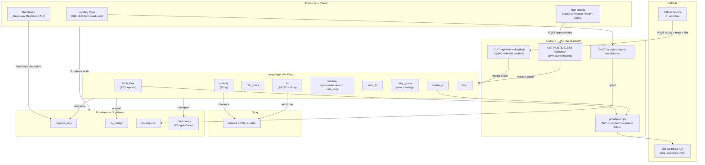

<p align="center">
  
  <h1 align="center">Alethia</h1>
</p>

<p align="center">
  <strong>A self-healing CI/CD GitHub App that classifies test failures, generates patches, and opens Pull Requests — with a human-in-the-loop approval gate.</strong><br>
  <a href="https://alethia-gamma.vercel.app/">Live Application</a>
</p>

---

## Overview

When a CI run fails, developers typically read the error, diagnose the root cause, edit the test or source, and push a fix. If the failure is a **test mismatch** — the application changed intentionally and the test assertion is now outdated — Alethia automates that entire loop.

A GitHub Actions workflow posts the pytest failure log to Alethia's webhook. A LangGraph workflow classifies the failure, pauses for human approval, generates a surgical patch using libCST, runs the tests to validate the patch, and opens a Pull Request if they pass. The developer reviews and merges.

The problem it solves is real but narrow: it handles `TEST_MISMATCH` failures (outdated test assertions after intentional application changes). It stops immediately for `APP_BUG`, `ENV_CONFIG`, `FLAKY`, and `UNCLASSIFIABLE` categories — it does not attempt fixes that require application-level reasoning.

---

## How It Works

```text
GitHub CI fails
  --> GitHub Actions posts pytest log to POST /api/webhook/github
    --> log_parser extracts test file, function, line, and assertion error
      --> pipeline_run record created in Supabase (status: CLASSIFYING)
        --> LangGraph graph starts in background thread

              fetch_files node
                 fetches test file + source file via GitHub App API (AST import resolution)
              |
              v
              classify node
                 sends assertion error + file contents to Groq (llama-3.3-70b-versatile)
                 returns: TEST_MISMATCH | APP_BUG | ENV_CONFIG | FLAKY | UNCLASSIFIABLE

    +-- if NOT TEST_MISMATCH ---------------------------------------------------+
    |   stop node --> status: STOPPED --> graph ends                            |
    +---------------------------------------------------------------------------+

    +-- if TEST_MISMATCH + MANUAL mode -----------------------------------------+
    |   hitl_gate node --> status: WAITING_FOR_APPROVAL                         |
    |   graph pauses (LangGraph checkpoint persisted in PostgreSQL)             |
    |                                                                           |
    |   Developer reads classification + AI reasoning on dashboard              |
    |   Developer optionally types a hint ("Use mock for the HTTP client")      |
    |   Developer clicks Approve                                                |
    |                                                                           |
    |   POST /api/runs/{id}/approve --> graph resumes from checkpoint           |
    +---------------------------------------------------------------------------+

    +-- if TEST_MISMATCH + AUTOPILOT mode --------------------------------------+
    |   graph routes directly to fix node -- no pause                           |
    +---------------------------------------------------------------------------+

              fix node (fixer.py)
                 parses test file with libCST (FunctionFinder deep visitor)
                 extracts only failing function + module context (imports, fixtures)
                 asks Groq to return ONLY the corrected function definition
                 uses libCST CSTTransformer to replace only that function body
                 falls back to full-file rewrite if libCST parsing fails
                 computes unified diff
              |
              v
              validate node (validator.py)
                 downloads repo zipball from GitHub API into ephemeral workspace
                 scrubs backend secrets from test process environment
                 runs: pytest {test_path} -v --tb=short (60s timeout)
              |
              v
              save_fix node
                 status: VALIDATED (if passed) or VALIDATION_FAILED (if failed)

    +-- if VALIDATION_FAILED + MANUAL mode -------------------------------------+
    |   retry_gate --> graph pauses again (max 2 attempts enforced)             |
    |   Developer provides new hint and clicks Retry Patch                      |
    |   POST /api/runs/{id}/retry --> graph resumes from retry_gate checkpoint  |
    |   fix --> validate loop repeats                                           |
    +---------------------------------------------------------------------------+

    +-- if VALIDATION_FAILED + AUTOPILOT mode OR retry_count >= 2 --------------+
    |   stop node --> status: STOPPED (MAX_RETRIES_EXCEEDED) --> graph ends     |
    +---------------------------------------------------------------------------+

    +-- if VALIDATED -----------------------------------------------------------+
    |   create_pr node                                                          |
    |     fetches original PR head branch                                       |
    |     creates fix branch: realive/fix-{run_id[:8]}-{short_id}              |
    |     commits patched file: fix(tests): update {path} [realive]             |
    |     opens Pull Request targeting original feature branch                  |
    |     status: DELIVERED                                                     |
    +---------------------------------------------------------------------------+
```

---

## Architecture



---

## Key Features

**Verified as implemented:**

- **Zero-Daemon PaaS Architecture** — Deploys cleanly on **Vercel** (frontend) and **Render** (FastAPI backend) with **Supabase** (PostgreSQL). No complex Docker socket mounts (`/var/run/docker.sock`) or container orchestration required.
- **HMAC-SHA256 Webhook Verification** — Signature checked against `GITHUB_WEBHOOK_SECRET` before processing; 403 on mismatch.
- **Optimized Webhook Ingestion** — Synchronous blocking network calls removed from the hot path. Immediate deduplication against active runs or already opened fix PRs.
- **AST-Based Source Resolution** — Test files are parsed using Python's `ast` standard library to discover real imported source modules, avoiding blind directory guessing.
- **AI Failure Classification** — Groq `llama-3.3-70b-versatile` classifies each failure with JSON-mode structured output and confidence scores.
- **LangGraph Stateful Workflow** — Nine-node graph with `interrupt_after=["hitl_gate", "retry_gate"]`. State checkpointed to PostgreSQL via `PostgresSaver` with in-memory fallback.
- **libCST Deep Function Patching** — Uses `FunctionFinder(cst.CSTVisitor)` to locate and surgically replace only the failing function body at any nesting depth (including inner classes), leaving all other code byte-for-byte identical.
- **Human-in-the-Loop Approval Gate** — Workflow pauses after classification; developer reviews AI diagnosis, optionally provides a hint, and approves or rejects from the dashboard.
- **Strict Retry Ceiling** — Prevents infinite retry loops; hard stop enforced at 2 retry attempts across both graph routing and API endpoints.
- **Ephemeral Test Validation with Secret Scrubbing** — Tests run in disposable temporary workspaces with a 60-second timeout. Backend secrets (`*_KEY`, `*_SECRET`, `*_TOKEN`, `DATABASE_URL`) are stripped from the test process environment (`safe_env`).
- **In-Memory Token Caching** — GitHub App installation tokens are cached in-memory with a 55-minute TTL, eliminating 7–10 redundant GitHub auth calls per run.
- **Automated Pull Request Creation** — Creates a fix branch from the original PR's head branch (not `main`), commits the surgical patch, and opens a PR with the full diagnosis in the body.
- **Least-Privilege OAuth** — GitHub OAuth requests only `read:user` instead of intrusive `repo` write permissions.
- **Unified API & Supabase Realtime** — Dashboard and details view query authenticated FastAPI backend endpoints, while Supabase Realtime provides live push updates without polling.
- **Immutable Audit Log** — Every action (`WEBHOOK_RECEIVED`, `CLASSIFIED`, `APPROVED`, `FIX_GENERATED`, `PR_OPENED`, `STOPPED`) is appended to `fix_history`.

---

## Technical Architecture & Design Decisions

### Why Vercel + Render + Ephemeral Subprocess (Path A)?

A common anti-pattern in developer tooling is running Docker-in-Docker on application servers. When building a self-healing CI/CD agent, the initial instinct is often: *"run every test inside a dedicated Docker container."*

In practice:
1. **PaaS Incompatibility**: Standard PaaS hosts like Render, Railway, and Heroku do not allow mounting `/var/run/docker.sock` to spawn sibling containers due to multi-tenant security restrictions. Running Docker requires maintaining expensive, self-managed VPS instances (EC2/Hetzner).
2. **Specialized Tooling**: Alethia is purpose-built for Python `pytest` test suites. Its log parser expects pytest output, and its fixer uses Python Concrete Syntax Trees (`libcst`).
3. **Defense-in-Depth without Docker**: Instead of heavy container daemons, Alethia validates patches in an ephemeral workspace (`tempfile.mkdtemp`), installs requirements in a transient virtual environment, explicitly scrubs all sensitive server environment variables (`safe_env`), enforces a 60-second execution timeout, and wipes the directory immediately in a `finally` block.

This achieves fast test execution, zero daemon overhead, and immediate deployability on Render and Vercel.

### libCST Surgical Patching vs. Full-File Rewrite

LLMs that rewrite entire source files introduce syntax noise: reformatted whitespace, renamed variables, dropped comments, and hallucinated imports. libCST operates directly on the Concrete Syntax Tree:

1. Parses the test file into a CST.
2. Extracts only the failing function body and module imports via `FunctionFinder(cst.CSTVisitor)`.
3. Sends that narrow snippet to Groq — not the whole file.
4. Parses the LLM's response and extracts the replacement `FunctionDef`.
5. Uses `CSTTransformer` to splice only that function body and return annotation.

The fallback (full-file rewrite) activates only if CST parsing fails on malformed files.

---

## Tech Stack

| Layer | Technology |
|---|---|
| Frontend | React 19, Vite 8, React Router 7, Supabase JS |
| Styling | Custom CSS (zero framework dependencies) |
| Backend | FastAPI 0.115, Uvicorn, Python 3.12+ |
| Configuration | Pydantic Settings |
| AI Workflow | LangGraph 0.2, LangChain Core |
| AI Provider | Groq — `llama-3.3-70b-versatile` |
| Patch Generation | libCST 1.5 (Concrete Syntax Tree) |
| GitHub Integration | GitHub App (JWT + cached installation tokens), PyGitHub |
| Database | PostgreSQL via Supabase |
| Realtime | Supabase Realtime (WebSocket `postgres_changes`) |
| Checkpointing | LangGraph `PostgresSaver` with in-memory fallback |
| Deployment | **Vercel** (frontend), **Render** (backend) |

---

## Getting Started

### Prerequisites

- Python 3.12+
- Node.js 18+
- A [Supabase](https://supabase.com) project
- A [GitHub App](https://github.com/settings/apps/new) registered on your account
- A [Groq](https://console.groq.com) API key (free tier)

### 1. Clone and Configure

```bash
git clone https://github.com/imshreyaskn/alethia.git
cd alethia
cp .env.example .env
# Fill in your secrets in .env
```

### 2. Database Setup

In your Supabase project SQL Editor, run migrations in order:

```sql
backend/migrations/001_core_tables.sql
backend/migrations/002_add_columns.sql
backend/migrations/002_enable_rls.sql
backend/migrations/003_saas_readiness.sql
backend/migrations/004_delete_policy.sql
backend/migrations/005_schema_fixes.sql
```

### 3. Start Backend

```bash
cd backend
python -m venv .venv
.venv\Scripts\activate          # Windows
# source .venv/bin/activate     # macOS/Linux
pip install -r requirements.txt
pip install -r ../agent/requirements.txt
cd ..
pip install -e .
cd backend
uvicorn app.main:app --reload --port 8000
```

### 4. Start Frontend

```bash
cd frontend
npm install
npm run dev                     # http://localhost:5173
```

### 5. Expose Webhook for Local Development

```bash
ngrok http 8000
# Set your GitHub App webhook URL to: https://<your-ngrok-url>/api/webhook/github
```

---

## Configuration

**Backend (`.env` at repo root)**

| Variable | Description |
|---|---|
| `DEBUG` | `true` for local development; `false` in production |
| `FRONTEND_URL` | URL of your frontend (e.g. `https://alethia-gamma.vercel.app`) |
| `SUPABASE_URL` | Supabase project URL (`https://xxx.supabase.co`) |
| `SUPABASE_SERVICE_KEY` | Service role key (full DB access, bypasses RLS) |
| `DATABASE_URL` | Direct PostgreSQL URI for LangGraph `PostgresSaver` |
| `GITHUB_APP_ID` | Numeric ID of your registered GitHub App |
| `GITHUB_APP_PRIVATE_KEY` | RSA PEM private key, newlines escaped as `\n` |
| `GITHUB_WEBHOOK_SECRET` | Shared secret for HMAC signature verification |
| `GROQ_API_KEY` | Groq API key (console.groq.com) |
| `GROQ_MODEL` | Defaults to `llama-3.3-70b-versatile` |

**Frontend (`frontend/.env`)**

| Variable | Description |
|---|---|
| `VITE_SUPABASE_URL` | Same as `SUPABASE_URL` |
| `VITE_SUPABASE_ANON_KEY` | Supabase anon key (publicly safe) |
| `VITE_API_URL` | Backend URL, e.g. `http://localhost:8000/api` |
| `VITE_GITHUB_APP_NAME` | Your GitHub App slug for install redirection |

---

## Project Structure

```text
alethia/
├── agent/                      # LangGraph workflow & repair nodes
│   ├── graph.py                # Graph definition, routing, checkpointing
│   ├── state.py                # AgentState TypedDict
│   └── nodes/
│       ├── fetcher.py          # AST import parsing + GitHub file fetching
│       ├── classifier.py       # Groq inference - failure categorization
│       ├── fixer.py            # libCST FunctionFinder visitor + Groq patcher
│       ├── validator.py        # Ephemeral workspace pytest execution
│       ├── pr_creator.py       # Creates branch, commits patch, opens PR
│       └── stopper.py          # Marks run STOPPED (records stop reasons)
│
├── backend/                    # FastAPI service (Render-ready)
│   ├── app/
│   │   ├── main.py             # App entry, scoped CORS, router mounts
│   │   ├── api/
│   │   │   ├── webhook.py      # Entry point: HMAC verify, parse, start graph
│   │   │   ├── runs.py         # HITL approve, retry, reject, delete endpoints
│   │   │   ├── github.py       # Installation sync endpoint
│   │   │   └── health.py
│   │   ├── core/
│   │   │   ├── auth.py         # FastAPI dependency - Supabase JWT validation
│   │   │   ├── config.py       # Pydantic Settings
│   │   │   └── log_parser.py   # Regex parser for pytest --tb=short
│   │   ├── db/client.py        # Supabase client singleton
│   │   └── github/auth.py      # Cached GitHub App installation tokens
│   ├── migrations/             # 001 - 005 SQL migrations
│   ├── scripts/                # Database checks & maintenance utilities
│   └── tests/                  # Pytest test suite (unit + regression)
│
├── frontend/                   # React 19 SPA (Vercel-ready)
│   └── src/
│       ├── App.jsx             # Router, auth guard, navbar
│       ├── pages/
│       │   ├── LandingPage.jsx # Least-privilege GitHub OAuth login
│       │   ├── Dashboard.jsx   # Live run list (Realtime subscription)
│       │   ├── RunDetails.jsx  # HITL UI, diff minimap, retry gate, delete
│       │   └── AuthCallback.jsx # Installation sync & routing
│       └── components/         # StatusBadge, DecryptedText, GlitchLoader
│
├── pyproject.toml              # Workspace package configuration
└── .env.example
```

---

## Demo

**[https://alethia-gamma.vercel.app/](https://alethia-gamma.vercel.app/)**

---

## License

MIT
